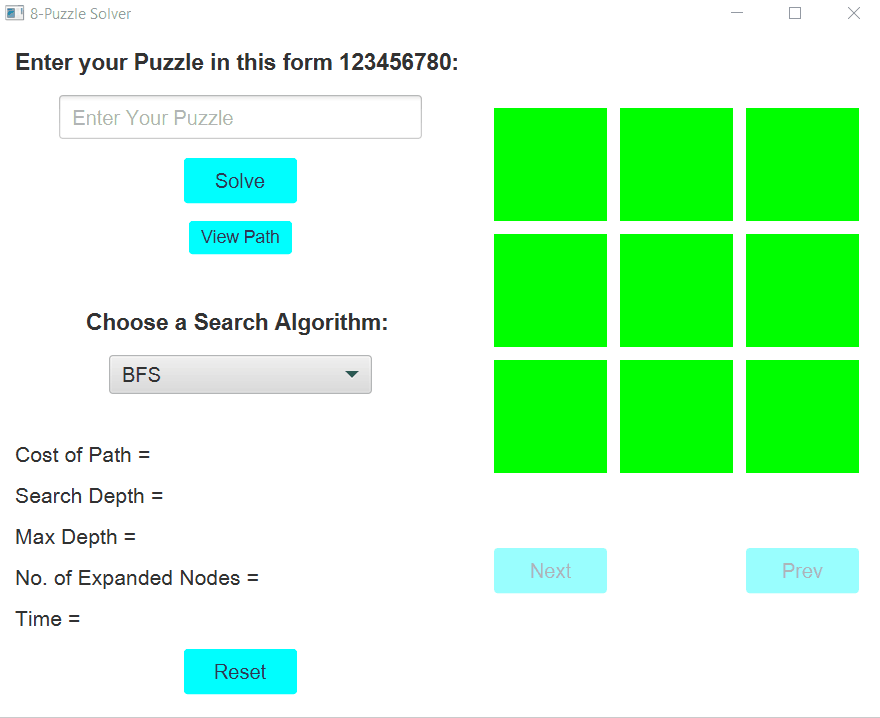

# 8-Puzzle-Solver
- This is an 8-puzzle solver implemented in Java & JavaFX, CSS for GUI.

## Search Algorithms
### 1- DFS
- DFS is an uninformed search algorithm that starts by expanding the deepest node in the frontier first.
    
### 2- BFS
- BFS is an uninformed search algorithm that expands the root first, followed by all the successors of the root, and so on.
    
### 3- A*
- A* is an informed search algorithm that uses the evaluation function f(n) = g(n) + h(n).
    - g(n) represents the cost of the path from the start node to the goal.
    - h(n) is the estimated cost of the shortest path.
    
- Heuristic Estimation Methods:
    1. Manhattan Distance.
    2. Euclidean Distance.
    
## Demo
